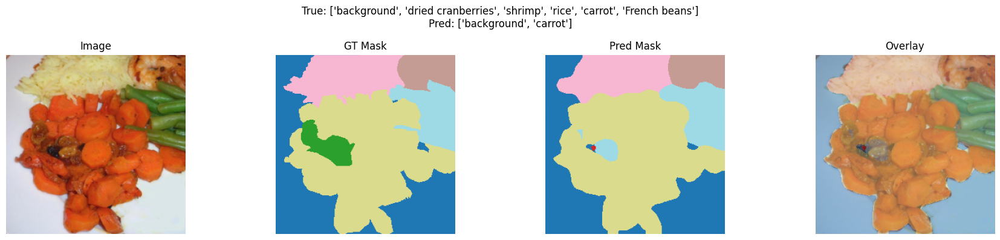

# Food Classification and Segmentation (TODO)

A deep learning project for classifying and segmenting food items in images.

## Table of Contents

- [Overview](#overview)
- [Features](#features)
- [Installation](#installation)
- [Usage](#usage)
- [Dataset](#dataset)
- [Model Architecture](#model-architecture)
- [Results](#results)
- [Contributing](#contributing)
- [License](#license)

## Overview

This project leverages state-of-the-art deep learning techniques to automatically classify and segment different types of food in images. The goal is to assist in dietary analysis, calorie estimation, and food recognition applications.

## Features

- Food image classification
- Semantic segmentation of food items
- Pre-trained models and training scripts
- Evaluation metrics and visualization tools

## Installation

1. Clone the repository:
    ```bash
    git clone https://github.com/yourusername/food-classification-and-segmentation.git
    cd food-classification-and-segmentation
    ```
2. Install dependencies:
    ```bash
    pip install -r requirements.txt
    ```

## Usage

Run the project.ipynb

## Dataset

This project uses the [FoodSeg103](https://xiongweiwu.github.io/foodseg103.html) dataset.

## Model Architecture

The project uses shared resNet50 backbone and 2 heads for classification and segmentation.

## Results

| Model      | Accuracy | mIoU  |
|------------|----------|-------|
| ResNet50   | 85%      | 0.78  |
| EfficientNet | 88%    | 0.81  |

Sample Results:



